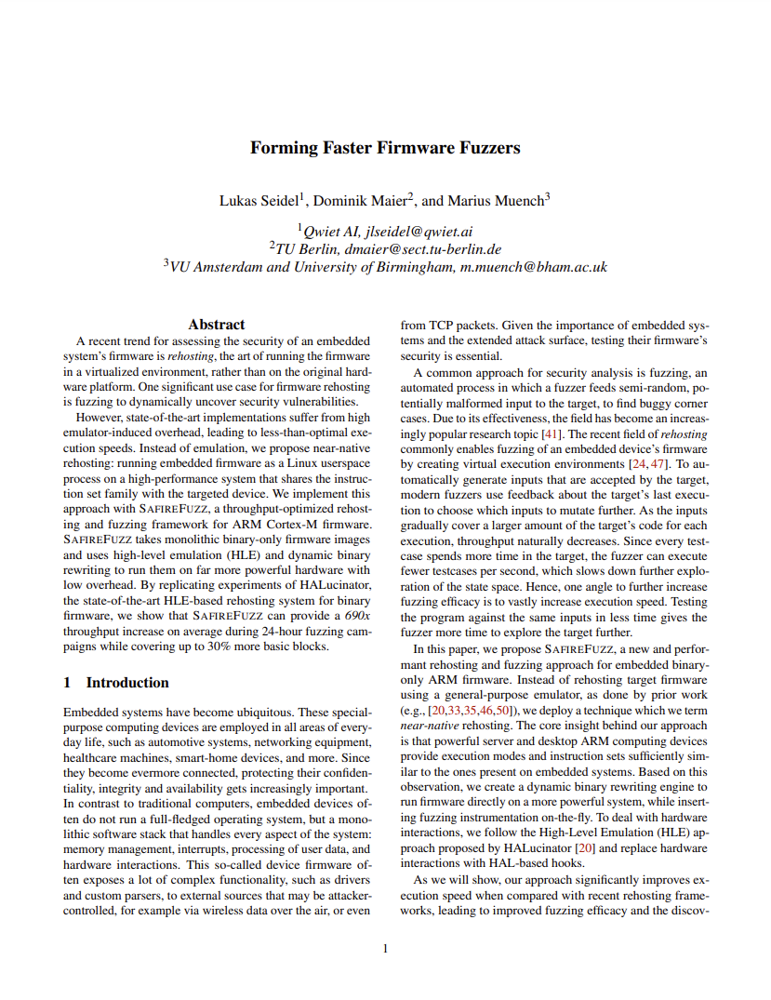
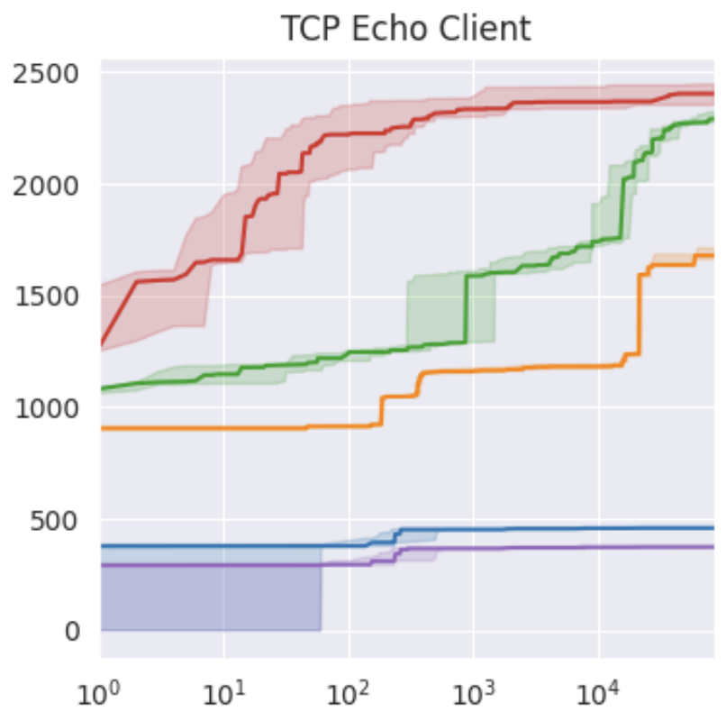

# SAFIREFUZZ
_Same-Architecture Firmware Rehosting and Fuzzing_


<a href="https://arxiv.org/pdf/tobeupdated"> </a>

## Introduction
We propose near-native rehosting: running embedded firmware as a Linux userspace
process on a high-performance system that shares the instruction set family with the targeted device. 
SAFIREFUZZ is a throughput-optimized rehosting and fuzzing framework for ARM Cortex-M firmware.
It takes monolithic binary-only firmware images and uses high-level emulation (HLE) and dynamic binary
rewriting to run them on far more powerful hardware with low overhead.  
This repository holds the code for the USENIX `23 publication "Forming Faster Firmware Fuzzers".

<br />

## Installation
1. Install the cargo cross compilation toolchain for `armv7-unknown-linux-gnueabihf` as well as `gcc-arm-unknown-linux-gnueabihf` and `g++-arm-unknown-linux-gnueabihf`.  
    Add the following to your cargo config in `~/.cargo/config`:
    ```
    [target.armv7-unknown-linux-gnueabihf]
    linker = "arm-linux-gnueabihf-gcc"
    ```

2. Checkout the submodules at the correct commit:
    ```bash
    git submodule update --init --recursive
    ```

3. Import the harness you want to execute at the top of `engine.rs`:
    ```rust
    use crate::harness::wycinwyc as harness;
    ```
    Whenever you change the target and/or harness, you need to re-compile the binary.

4. Build with
    ```bash
    cargo build --release --target armv7-unknown-linux-gnueabihf
    ```
    The `rust-toolchain` file automatically sets the correct compiler version.

5. Configure your system before the first execution:
The `prepare_sys.sh` script disables ASLR and allows mapping of virtual memory down to address 0.  
Note, that a CPU supporting ARMv7-M is required, e.g.,  Cortex-A72s found in Raspberry Pi 4s.

## Usage
- A single file or all files in a directory can be executed N (e.g., 1000) times with
  ```
  ./safirefuzz -b firmware/atmel_6lowpan_udp_rx.bin -i inputs/atmel_6lowpan_udp_rx/input/input1 -n 1000
  ```
- To start fuzzing a harness with LibAFL, simply specify `-f`:
  ```
  ./safirefuzz -b firmware/wycinwyc.bin -i inputs/wycinwyc -f
  ```

Firmware binaries and fuzzing seeds used during our evaluation will be made available at https://github.com/pr0me/safirefuzz-experiments.

## Harnessing
A basic harness skeleton is provided in `src/harness/skeleton.rs`.  
The engine expects any harness to implement the following interfaces:
```rust
pub static mut EMU_SP: u32;
pub static mut ENTRY: u32;
pub fn set_hooks();
pub fn reset();
pub fn setup(code: &[u8], offset: u32) -> Result<(), String>;
```
We provide example harnesses for multiple real-world targets.

## Performance
We fuzz 12 targets in 24-hour campaigns and achieve an average throughput increase of more than 600x and 30% more coverage when compared to [HALucinator](https://github.com/ucsb-seclab/hal-fuzz), a state-of-the-art firmware fuzzing approach using high-level emulation and [Unicorn](https://github.com/unicorn-engine/unicorn). 



The plot shows the median and 95% confidence intervals over five 24-hour runs for the TCP Echo Client target.
Coverage is reported in number of reached basic blocks and time is on a log scale.
SAFIREFUZZ (red) achieves better coverage in a fraction of the time when compared to HALucinator (orange), HALucinator when replacing the backend with [LibAFL](https://github.com/AFLplusplus/LibAFL) (green), [FuzzWare](https://github.com/fuzzware-fuzzer/fuzzware) (blue) and FuzzWare not counting basic blocks inside the Hardware-Abstraction-Layer (purple).  
On this target, we achieve 3400 executions per second, compared to 4.8 for HALucinator and 87.2 for FuzzWare.

A thorough performance evaluation can be found in our paper.  
Experiment data will be made available at https://github.com/pr0me/safirefuzz-experiments.

<br />

## Citation
```
@inproceedings{seidel2023ffff,
  title={Forming Faster Firmware Fuzzers},
  author={Seidel, Lukas and Maier, Dominik and Muench, Marius},
  booktitle={USENIX 2023},
  year={2023}
}
```
